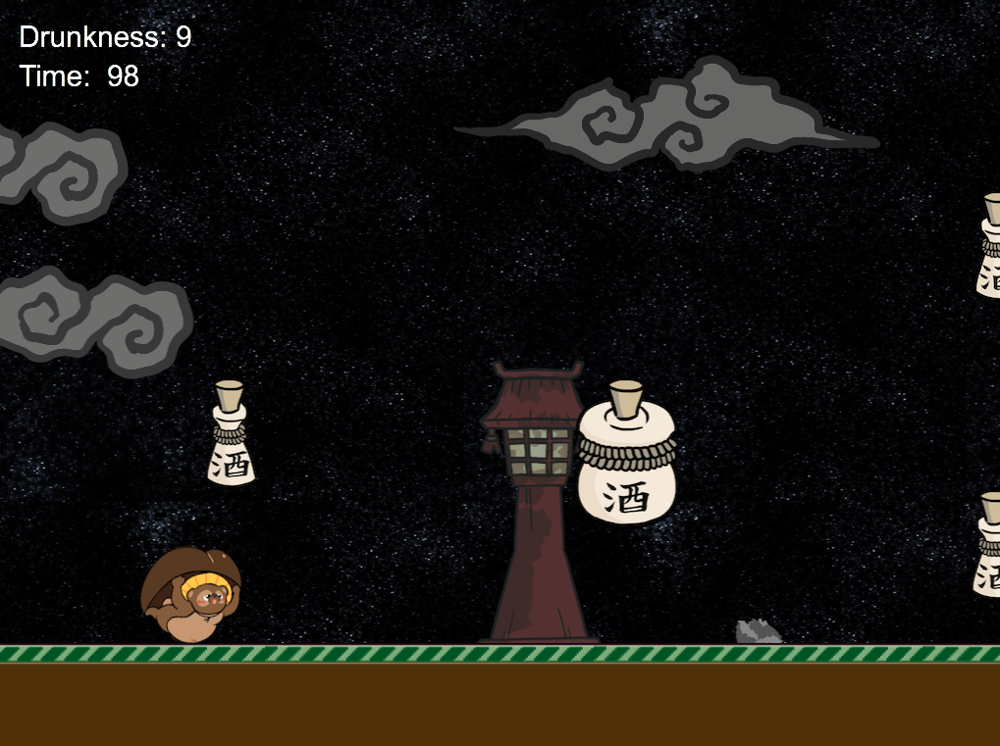
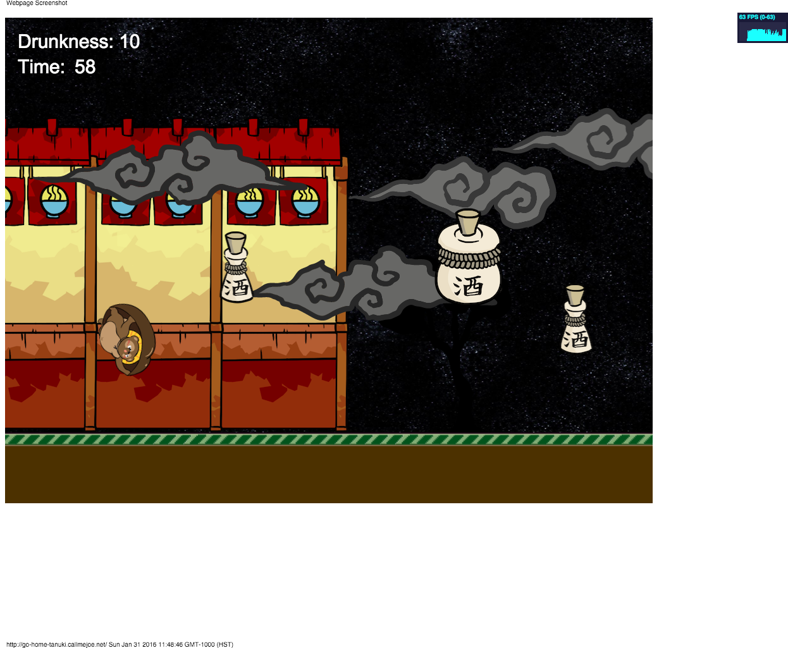
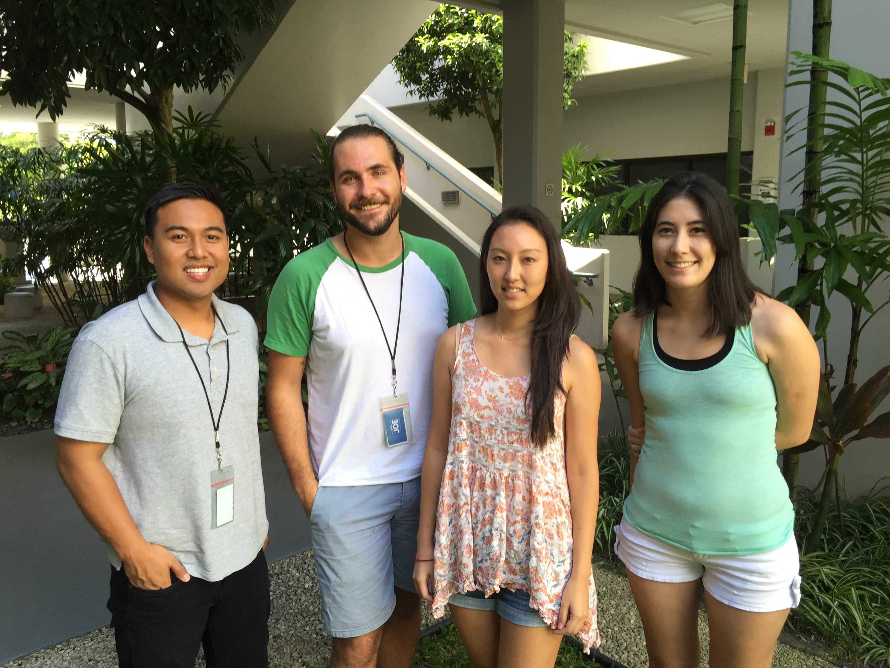
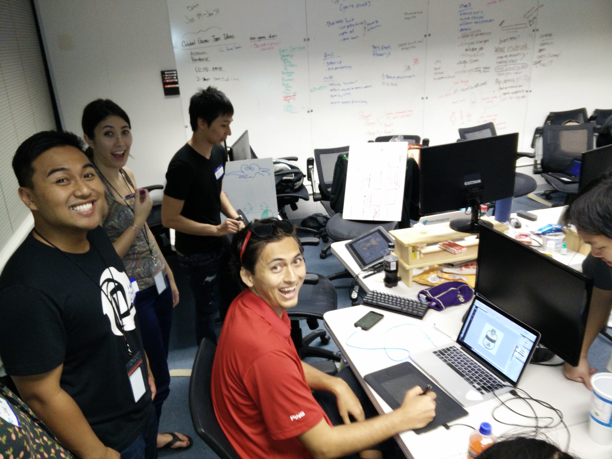

# Go Home Tanuki (You're Drunk)

### A Phaser.js Game

The fox-like Tanuki often appears in Japanese folklore as a shape-shifter with supernatural powers and mischievous tendencies, and is the protagonist of our game.

Go Home Tanuki (You're Drunk) was created at Global Game Jam 2016 and uses the theme "Ritual" to exemplify the results of a demanding work ethic common in Japan. Tanuki spends his days working, drinking, going home, repeat - and the player's job is to make sure he gets home safely, at least for tonight.

## 🎮 Play the Game

Play the game at: [https://joekarlsson1.github.io/go-home-tanuki/](https://joekarlsson1.github.io/go-home-tanuki/)


## 📸 Game Screenshots





[Check out our gameplay footage here](https://youtu.be/7DED6sdNvCY)

## 🚀 Getting Started

### Prerequisites

- [Node.js](https://nodejs.org/) (version 18 or higher)

### Installation

1. Clone the repository:

```bash
git clone https://github.com/JoeKarlsson1/go-home-tanuki
cd go-home-tanuki
```

2. Install dependencies:

```bash
npm install
```

3. Start the development server:

```bash
npm run dev
```

The game will be available at `http://localhost:3017/go-home-tanuki/`

## 🧪 Testing

The project includes a comprehensive testing setup using Jest:

```bash
# Run all tests
npm test

# Run tests in watch mode
npm run test:watch

# Run tests with coverage
npm run test:coverage

# Run tests for CI
npm run test:ci
```

### Test Coverage

The project maintains 70% coverage thresholds for:

- Branches
- Functions  
- Lines
- Statements

### Test Structure

- **Configuration Tests**: Game properties and settings
- **Utility Tests**: Asset management and performance monitoring
- **Game Logic Tests**: Core game mechanics and functions
- **State Management Tests**: Game state transitions and UI
- **Integration Tests**: End-to-end functionality

See [TESTING.md](./TESTING.md) for detailed testing documentation.

## 🛠️ Available Commands

### `npm run dev`

Starts a development server with hot module replacement at `http://localhost:3017/go-home-tanuki/`

### `npm run build`

Creates an optimized production build in the `dist` directory.

### `npm run preview`

Preview the production build locally.

## 📦 What's Inside

- **[Vite](https://vitejs.dev/)** - Lightning fast build tool
- **[Phaser 2.6.2](http://phaser.io/)** - HTML5 game framework
- **ES6 Modules** - Modern JavaScript
- **GitHub Actions** - Automatic deployment to GitHub Pages

## 🚢 Deployment

The game automatically deploys to GitHub Pages when you push to the main branch. The GitHub Actions workflow (`.github/workflows/deploy.yml`) handles building and deploying the game.

To enable GitHub Pages:

1. Go to your repository settings
2. Navigate to Pages
3. Set Source to "GitHub Actions"

## 🤝 Contributing

1. Fork it!
2. Create your feature branch: `git checkout -b my-new-feature`
3. Commit your changes: `git commit -am 'Add some feature'`
4. Push to the branch: `git push origin my-new-feature`
5. Submit a pull request 🎉

## 👥 Created By

- [Joe Karlsson](https://www.joekarlsson.com/)
- [Corina Jacobson](https://github.com/corinajacobson)
- [Sarah Kurisu](https://github.com/skurisu)
- [Kent Salcedo](https://github.com/kentsalcedo)



## 🎨 Art By

- Bao Nguyen
- Gabe



## 📄 License

The MIT License (MIT)

Copyright (c) 2025 Joe Karlsson

Permission is hereby granted, free of charge, to any person obtaining a copy
of this software and associated documentation files (the "Software"), to deal
in the Software without restriction, including without limitation the rights
to use, copy, modify, merge, publish, distribute, sublicense, and/or sell
copies of the Software, and to permit persons to whom the Software is
furnished to do so, subject to the following conditions:

The above copyright notice and this permission notice shall be included in all
copies or substantial portions of the Software.

THE SOFTWARE IS PROVIDED "AS IS", WITHOUT WARRANTY OF ANY KIND, EXPRESS OR
IMPLIED, INCLUDING BUT NOT LIMITED TO THE WARRANTIES OF MERCHANTABILITY,
FITNESS FOR A PARTICULAR PURPOSE AND NONINFRINGEMENT. IN NO EVENT SHALL THE
AUTHORS OR COPYRIGHT HOLDERS BE LIABLE FOR ANY CLAIM, DAMAGES OR OTHER
LIABILITY, WHETHER IN AN ACTION OF CONTRACT, TORT OR OTHERWISE, ARISING FROM,
OUT OF OR IN CONNECTION WITH THE SOFTWARE OR THE USE OR OTHER DEALINGS IN THE
SOFTWARE.
